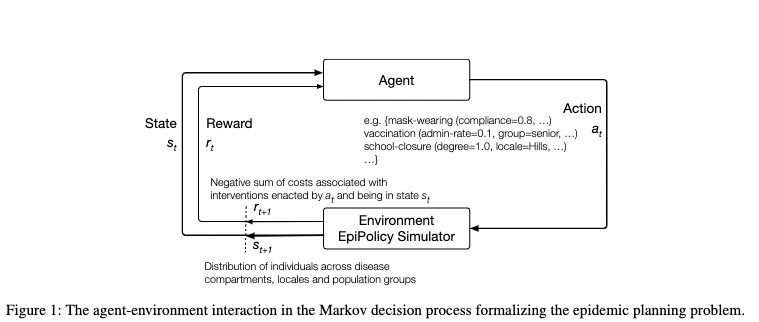

# RL-Epidemic-Benchmark
PyTorch implementation of the paper:

- **Title**: *Planning Multiple Epidemic Interventions with Reinforcement Learning* 
- **ArXiv**: [coming soon] 
<!-- - **Authors**:  -->
<!-- - **Conference**:  -->
<!-- - More details:  -->

### Abstract 

Combating an epidemic entails finding a plan that describes when and how to apply different interventions, such as mask-wearing mandates, vaccinations, school or workplace closures. An optimal plan will curb an epidemic with minimal loss of life, disease burden, and economic cost. Finding an optimal plan is an intractable computational problem in realistic settings. Policy-makers, however, would greatly benefit from tools that can efficiently search for plans that minimize disease and economic costs especially when considering multiple possible interventions over a continuous and complex action space given a continuous and equally complex state space. We formulate this problem as a Markov decision process. Our formulation is unique in its ability to represent multiple continuous interventions over any disease model defined by ordinary differential equations. We illustrate how to effectively apply state-of-the-art actor-critic reinforcement learning algorithms (PPO and SAC) to search for plans that minimize overall costs. We empirically evaluate the learning performance of these algorithms and compare their performance to hand-crafted baselines that mimic plans constructed by policy-makers. Our method outperforms baselines. Our work confirms the viability of a computational approach to support policy-makers. 

